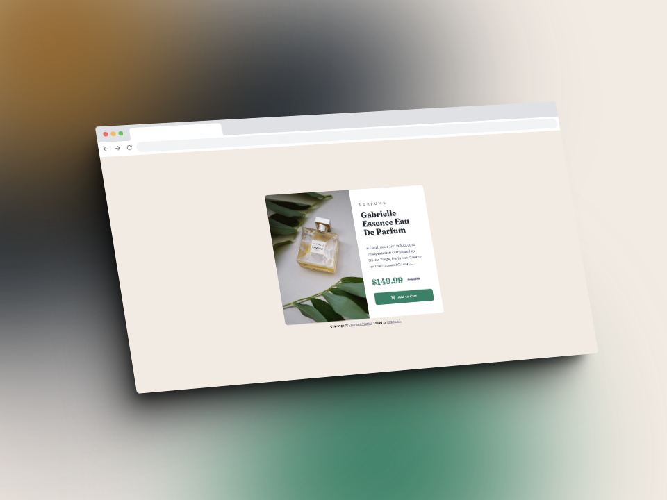

# Frontend Mentor - Product preview card component solution

This is my solution to the [Product preview card component challenge on Frontend Mentor](https://www.frontendmentor.io/challenges/product-preview-card-component-GO7UmttRfa).

## Overview

### The challenge

Users should be able to:

- View the optimal layout depending on their device's screen size
- See hover and focus states for interactive elements

### Screenshots

#### Desktop view

#### Mobile view

### Links

- Live Site URL: [Vercel](https://product-preview-card-component-orianapg.vercel.app/)
- Solution URL: [Frontend Mentor](https://www.frontendmentor.io/solutions/product-preview-card-component-N3egbyRHbK)

## My process

### Built with

- Semantic HTML5 markup
- CSS custom properties
- Flexbox
- Media queries
- Mobile-first workflow
  