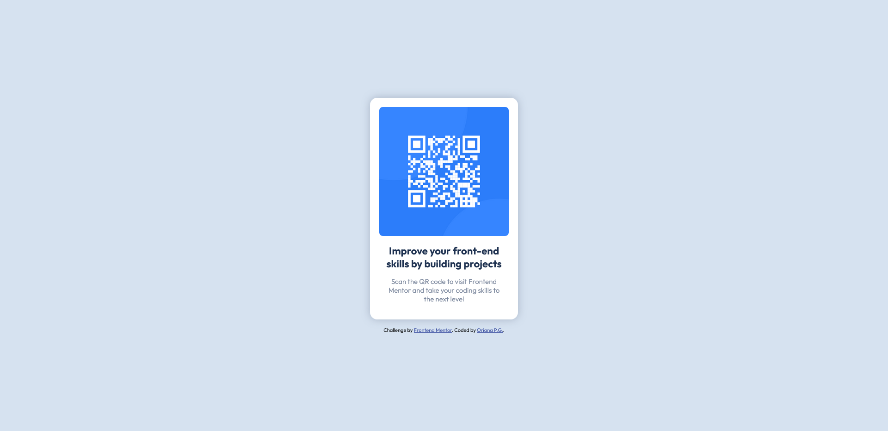

# QR code component solution

This is a solution to the [QR code component challenge on Frontend Mentor](https://www.frontendmentor.io/challenges/qr-code-component-iux_sIO_H). 

## Table of contents

- [QR code component solution](#qr-code-component-solution)
  - [Table of contents](#table-of-contents)
  - [Overview](#overview)
    - [Screenshot](#screenshot)
    - [Links](#links)
  - [Author](#author)

## Overview

### Screenshot

### Links

- Solution URL: [Frontend Mentor](https://www.frontendmentor.io/solutions/qr-code-component-using-flexbox-zLpicKHx07)
- Live Site URL: [Vercel](https://qr-code-component-l58vl0nkt-orianapg.vercel.app/)

## Author

- LinkedIn - [Oriana P.G.](https://www.linkedin.com/in/orianapg/)
- Frontend Mentor - [@orianapg](https://www.frontendmentor.io/profile/orianapg)
