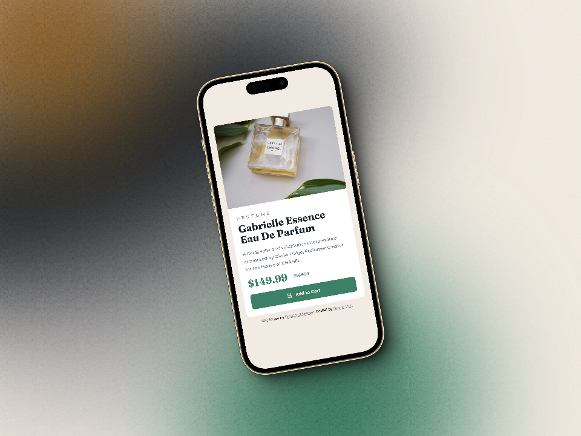

# Frontend Mentor Challenges

These are my solutions to [Frontend Mentor's challenges](https://www.frontendmentor.io/challenges).

## Projects

### Interactive Rating Component

### Product Preview Card

### QR Code Component

## Author

- LinkedIn - [Oriana P.G.](https://www.linkedin.com/in/orianapg/)
- Frontend Mentor - [@orianapg](https://www.frontendmentor.io/profile/orianapg)

## License

This project is licensed under the MIT License.
